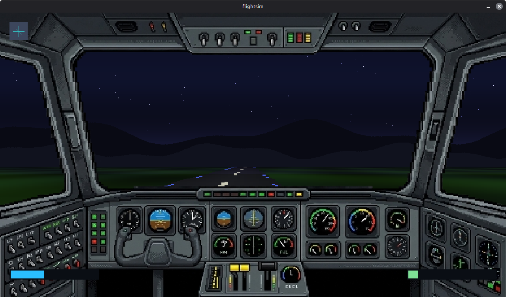

## flightsim

To build, install the <a href="https://github.com/spectrelang/spectre">Spectre Programming Language</a> toolchain, and run:

```
spectre build dev
```

Controls:

- A/D - Yaw
- Up/Down - Pitch
- W/S - Throttle
- V/C - Toggle third person

Requires SDL2 to be installed, only tested on Linux/MacOS.


